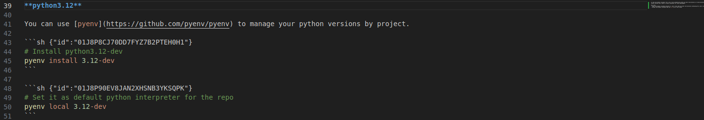
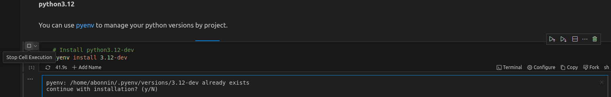

# Sentinel3-SRAL-Demo

### Project Overview

This project demonstrates how to download and store Sentinel-3 EUMETSAT products into a partitioned Zarr collection. Data is fetched via the [EUMDAC](https://anaconda.org/eumetsat/eumdac) library, and the code is heavily inspired by the EUMETSAT [learn-sral](https://gitlab.eumetsat.int/eumetlab/oceans/ocean-training/sensors/learn-sral) repository.

By default, data is downloaded from the EUMETSAT collection **ID(EO:EUM:DAT:0415): SRAL Level 2 Altimetry Global - Sentinel-3**, but this can be changed.

This collection contains files (products) from Sentinel-3A and 3B with Level 2 processed altimetry data. Each product includes three datasets:

- `reduced_measurement.nc` (1Hz)
- `standard_measurement.nc` (20Hz)
- `enhanced_measurement.nc` (20Hz + additional data)

For now, I only process the `reduced_measurement.nc` datasets from each product as I distribute code on a single computer. EUMDAC Products matching the openSearch query filters are downloaded and only `reduced_measurement.nc` datasets are extracted. Then the extracted datasets are persisted to a zarr collection, partitioned by month.

The dataset represents Level 2 data derived from along-track SRAL altimeter measurements, which include:

- Sea Surface Height: `ssha_01_ku` and `ssha_01_plrm_ku`
- Wind Speed: `wind_speed_alt_01_ku` and `wind_speed_alt_01_plrm_ku`
- Significant Wave Height: `swh_ocean_01_ku` and `swh_ocean_01_plrm_ku`
- Geophysical Corrections: `iono_cor_alt_01_ku`, `iono_cor_alt_filtered_01_ku`, etc.
- And many other data points.

As these measurements are along-track, the only dimension is time: `time_01` (1Hz). The `lon_01` and `lat_01` coordinates are related to time as the satellite moves along its orbit.

### Objectives

The focus is on producing simple code that implements good practices for generic Python projects:

| Quality Focus Area     | Library or Tool      | Fail Under                |
|------------------------|----------------------|---------------------------|
| Test Driven Development | Pre-commit Hooks     | All hooks must pass       |
| Coverage               | pytest-cov           | 100% coverage             |
| Unit Tests             | pytest               | All tests OK              |
| Linter                 | pylint               | 100% score (default rules)|
| Formatter              | black                | Non-compliant formatting   |
| Static type checks     | mypy                 | NEVER FAILS : Not configured in pre-commit hooks   |
| Code Documentation     | sphinx               | NEVER FAILS : Not configured in pre-commit hooks   |

This project primarily serves as a means for me to discover new technologies, including:

- Zarr
- Zcollections
- Dask
- Xarray

Ultimately, it provides a practical overview of spatial altimetry datasets and helps me understand the data that can be derived from these spatial altimeters.

**Note**: In its current state, this project is far from production-ready:

- Not packaged or Dockerized
- Script is not structured as a job: no checkpointing to download only new files
- No CI/CD
- No monitoring
- No clustering or distributed storage
- No regression tests
- dask implem is minimal (no error handling / tasks failure recovery)
- pytests are a bit limitted:
   - lack of edge case testing
   - lack of call parameters tests on methods and functions
   - but 100% code covering

## License

This code is licensed under the MIT License. See the `LICENSE.txt` file for details on usage and distribution terms.

## Authors

Antoine Bonnin

## Python Dependencies

This project relies on several key libraries for accessing and manipulating data. Below is a summary of the primary dependencies:

| Library      | Description                                                                                                                      | Documentation Link                                              |
|--------------|----------------------------------------------------------------------------------------------------------------------------------|----------------------------------------------------------------|
| EUDMAC       | Provides simple access to EUMETSAT data from various satellite missions.                                                        | [EUDMAC](https://anaconda.org/eumetsat/eumdac)                |
| Xarray       | A comprehensive tool for working with labeled multi-dimensional data in Python.                                                | [Xarray](https://docs.xarray.dev/en/stable/)                  |
| Dask         | A Python library for parallel and distributed computing, which integrates well with Xarray and Zcollections.                    | [Dask](https://docs.dask.org/en/stable/)                      |
| Zarr         | A file storage format for chunked, compressed N-dimensional arrays based on an open-source specification.                        | [Zarr](https://zarr.readthedocs.io/en/stable/)                |
| Zcollections  | A Python library in the Pangeo ecosystem for manipulating data partitioned into collections of Zarr groups. Primarily used for writing partitioned data and querying with filters. | [Zcollections](https://zcollection.readthedocs.io/en/latest/api.html) |

## Prerequisites

### Optional Tools

**[RUNME](https://runme.dev/)**

A nice tool to render and execute shell commands from markdown in VSCode. You can install the [VSCode extension](https://docs.runme.dev/getting-started/vscode).

Here is the README without the VSCode extension:



The VSCode extension allows you to execute shell code directly from your markdown file:



### Required Tools

**Python 3.12**

You can use [pyenv](https://github.com/pyenv/pyenv) to manage your Python versions by project.

```sh {"id":"01J8P8CJ70DD7FYZ7B2PTEH0H1"}
# Install python3.12-dev
pyenv install 3.12-dev
```

```sh {"id":"01J8P90EV8JAN2XHSNB3YKSQPK"}
# Set it as default python interpreter for the repo
pyenv local 3.12-dev
```

**[Conda](https://docs.anaconda.com/anaconda/install/index.html)**

Conda is needed to install some dependencies available only through conda channels. You can install [Miniconda](https://docs.anaconda.com/miniconda/) if you do not plan to use all of Anaconda's functionalities.

We use [libmamba](https://www.anaconda.com/blog/a-faster-conda-for-a-growing-community) solver to speed up dependency resolution.

```sh {"id":"01J8PCGEAAC83CN6JDQ7M79Q39"}
# Install libmamba solver
conda update -n base conda
conda install -n base conda-libmamba-solver
conda config --set solver libmamba
```

```sh {"id":"01J8PCRR9NS7NW97TNFKC2Q423"}
# Install project dependencies and setup 3.12 virtualenv
conda env create -f environment.yml --solver=libmamba
```

```sh {"id":"01J8PD7W29RA6FTWQFQ6ACNYRY"}
# Or update dependencies
conda env update --file environment.yml
```

```sh {"id":"01J8PCK4MF4GPRB83ECRK84VY3"}
# Use the project's virtualenv
conda activate sentinel3-sral-demo
```

```sh {"id":"01J8P9NSFP1JWKZXHZ0CDQD3H3"}
# (Optionnal) - setup precommit hooks (black, pylint, pytests)
pre-commit install
```

### Configuration requirements

#### EUMETSAT credentials file

First, create an account on [EUMETSAT eoportal](https://eoportal.eumetsat.int/cas/login)

Next, retrieve your credentials from [your Profile](https://api.eumetsat.int/api-key/). This is necessary for easy access to Sentinel-3 data.

Then, save your credentials to ~/.eumdac/credentials.ini:

```sh {"id":"01J8T3GWKJ78NSME8D352G5094"}
# Create your credentials file - Replace with your own credentials :)
mkdir -p ~/.eumdac
cat <<EOF > ~/.eumdac/credentials.ini
[myprofile]
consumer_key=my_key
consumer_secret=my_secret
EOF
```

#### Environment variables

# Project environment variables

| Variable Name           | Utility                                                                    | Default Value                   |
|-------------------------|----------------------------------------------------------------------------|---------------------------------|
| `LOG_LEVEL`             | Defines the logging level for the task and its modules.                    | `INFO`                          |
| `COLLECTION_ID`         | EUMDAC ID of the data collection being processed.                          | `EO:EUM:DAT:0415`               |
| `DOWNLOAD_DIR`          | Directory where downloaded EUMDAC products are stored.                     | `/tmp/products`                 |
| `MEASUREMENTS_FILENAME` | Filename for the reduced measurement data inside the EUMDAC products ZIP.  | `reduced_measurement.nc`        |
| `ZARR_BASE_PATH`        | Path where the Zarr collection will be saved.                              | `/tmp/sen3_sral`                |
| `INDEX_DIMENSION`       | Dimension to index the data for partitioning in Zarr.                      | `time_01`                       |

# CICD environment variables

**Note**: Storing credentials unencrypted on disk is not a good practice

| Variable Name           | Utility                                                   | Default Value                   |
|-------------------------|-----------------------------------------------------------|---------------------------------|
| `DOCKERHUB_USERNAME`    | Your dockerhub username, to upload the Docker image       | `abonnin33`                     |
| `DOCKERHUB_PASSWORD`    | Your dockerhub password, to upload the Docker image       |                                 |

```sh {"id":"01J91SMJW9PYFP2SAGYD38CPK2"}
# .envrc is not to be commited - in .gitignore
cp .envrc.tpl .envrc

# Edit variables in .envrc as you like
```

```sh {"id":"01J91SPEZF3S06DKMG6JFJN97C"}
# Load environment variables to your shell
source .envrc
```

Use **[direnv](https://direnv.net/)**:

- Loads environment variables declared in .envrc files when you cd into the directory containing the .envrc (or its subdirectories).
- Unloads environment variables when you cd out of that folder.

```sh {"id":"01J94H1KMMN5EGRVHW1DD5JBDJ"}
sudo apt install direnv

# Do not forget to configure the hook to your .bashrc
eval "$(direnv hook bash)" >> ~/.bashrc
source ~/.bashrc
direnv allow # In the folder containing .envrc, asked after each modification of .envrc
```

```sh {"id":"01J94H9KJ0YPPYB57MWS0M76XN"}
# or in zsh
eval "$(direnv hook zsh)" >> ~/.zshrc
source ~/.zshrc
direnv allow # In the folder containing .envrc, asked after each modification of .envrc
```

## Usage

### Local Execution

```sh {"id":"01J9200BMAX0X0ANYCCTW7AVC3"}
# In the conda environment, with dependencies installed
# And all prerequisites followed
python -m tasks.persist_sen3_sral_data_to_zarr
```

```sh {"id":"01J95WG8WDBVS95M05Q50TRCR1"}
# Typycal output
2024-10-02 18:40:30.628 INFO     | 127.0.1.1 PID:35125 TID:139685515002944 | __main__ <module> persist_sen3_sral_data_to_zarr.py: 92 | Connecting EUMDAC datastore...
2024-10-02 18:40:30.802 INFO     | 127.0.1.1 PID:35125 TID:139685515002944 | __main__ <module> persist_sen3_sral_data_to_zarr.py:104 | Listing EUMDAC products matching filters 'pi=EO:EUM:DAT:0415&dtstart=2024-09-23T00:20:00Z&dtend=2024-09-25T00:10:00Z'
2024-10-02 18:41:41.455 INFO     | 127.0.1.1 PID:35125 TID:139685515002944 | __main__ <module> persist_sen3_sral_data_to_zarr.py:109 | Local mode: processing every 50th product to debug faster
2024-10-02 18:41:41.455 INFO     | 127.0.1.1 PID:35125 TID:139685515002944 | __main__ <module> persist_sen3_sral_data_to_zarr.py:111 | 15 matching products found
2024-10-02 18:41:41.455 INFO     | 127.0.1.1 PID:35125 TID:139685515002944 | __main__ <module> persist_sen3_sral_data_to_zarr.py:115 | Downloading products (dask parallelized)...
2024-10-02 18:41:41.849 INFO     | 127.0.1.1 PID:35125 TID:139685515002944 | src.connectors.eumdac_connector download_products eumdac_connector.py:177 | Downloading products...
2024-10-02 18:42:57.373 INFO     | 127.0.1.1 PID:35125 TID:139685515002944 | __main__ <module> persist_sen3_sral_data_to_zarr.py:122 | Persisting data in a partitionned zarr collection...
2024-10-02 18:42:57.397 INFO     | 127.0.1.1 PID:35125 TID:139685515002944 | src.processors.zarr_processor netcdf_2_zarr zarr_processor.py:148 | Loading every netcdf files to a xr.Dataset...
2024-10-02 18:42:57.863 INFO     | 127.0.1.1 PID:35125 TID:139685515002944 | src.processors.zarr_processor netcdf_2_zarr zarr_processor.py:155 | Concat datasets to a single distributed xr.Dataset...
2024-10-02 18:42:58.760 INFO     | 127.0.1.1 PID:35125 TID:139685515002944 | zcollection.collection from_config __init__.py:283 | Opening collection: '/tmp/sen3_sral'
2024-10-02 18:42:58.762 INFO     | 127.0.1.1 PID:35125 TID:139685515002944 | src.processors.zarr_processor netcdf_2_zarr zarr_processor.py:163 | Inserting data to the zarr collection at /tmp/sen3_sral
2024-10-02 18:42:58.762 INFO     | 127.0.1.1 PID:35125 TID:139685515002944 | zcollection.collection insert __init__.py:360 | Inserting of a 6.63 MiB dataset in the collection
2024-10-02 18:42:59.268 INFO     | 127.0.1.1 PID:35125 TID:139685515002944 | __main__ <module> persist_sen3_sral_data_to_zarr.py:134 | Job done

```

```ini {"id":"01J962WW36KGTDEHPGCZEEJ70B"}
# Here is the zarr collection, partitioned by month on variable time_01
tree -a .
.
├── year=2024
│   └── month=09
│       ├── alt_01
│       │   ├── 0
│       │   ├── .zarray
│       │   └── .zattrs
│       ├── dist_coast_01
│       │   ├── 0
│       │   ├── .zarray
│       │   └── .zattrs
│       ├── gpd_source_flag_01
│       │   ├── 0
│       │   ├── .zarray
│       │   └── .zattrs
│       ├── gpd_wet_tropo_cor_01
│       │   ├── 0
│       │   ├── .zarray
│       │   └── .zattrs
...     ... 
│       ├── wind_speed_alt_01_ku
│       │   ├── 0
│       │   ├── .zarray
│       │   └── .zattrs
│       ├── wind_speed_alt_01_plrm_ku
│       │   ├── 0
│       │   ├── .zarray
│       │   └── .zattrs
│       ├── wind_speed_alt_2p_01_ku
│       │   ├── 0
│       │   ├── .zarray
│       │   └── .zattrs
│       ├── wind_speed_alt_2p_01_plrm_ku
│       │   ├── 0
│       │   ├── .zarray
│       │   └── .zattrs
│       ├── .zattrs
│       ├── .zgroup
│       └── .zmetadata
└── .zcollection

67 directories, 199 files
(arg: 4)

```

### Build and release Docker image to Dockerhub

The image for this project is available in my DockerHub Repositories: [sentinel3-sral-demo](https://hub.docker.com/repository/docker/abonnin33/sentinel3-sral-demo)

If you want to build the image yourself, follow the section below.

```sh {"id":"01J94WNGWCNZ88JBX7VFG7EC0M"}
# Build
source .envrc
make build
```

```sh {"id":"01J94XGW61WYZJKHDCEWKP3D5B"}
# Run code from Docker image
# map your local ~/.eumdac/ folder to the container via a volume (credentials sharing)
# use volumes for storage folders (DOWNLOAD_DIR / ZARR_BASE_PATH)
source .envrc
make run
```

```sh {"id":"01J94WSH88VNJX1M9T4CBSC3QY"}
# Upload - need to setup Dockerhub credentials in your .envrc
source .envrc
make upload
```

### K8s cluster execution

WIP.

### Quality

Quality is ensured by pre-commit hooks (see the pre-commit-config.yaml file). However, each quality tool can also be run on demand:

```sh {"id":"01J9207TSCB7YRF3P2QB6G8FRE"}
# manual Pytests with coverage
python -m pytest tests --cov=. --cov-report=term-missing --cov-fail-under=100
```

```sh {"id":"01J9208TSEMJQ1269V8GY60YN1"}
# Linter
python -m pylint .
```

```sh {"id":"01J920BK7X9AHJC7A36D5JWP1Z"}
# Formatting
black .
```

```sh {"id":"01J928Y2ZZ4KYGTHW8MDDZSDVD"}
# Static type checks - not set as a pre-commit hooks
# 'PEP 484 prohibits implicit Optional' is annoying -> leads to very verbose code
python -m mypy .
```

```sh {"id":"01J94K5E9C9Y6C1WB4P4KCCCHM"}
# Sphinx doc generation
sphinx-apidoc -o docs/source .
cd docs; make html; cd -
```

```sh {"id":"01J94MC96S53JH6NVS7ZKP4FNC"}
# Open doc
firefox docs/build/html/index.html
```

## TODO

- Pass arguments to the script: date range for file fetching
- implement a checkpointing mechanism with a small DB, to only fetch new products from EUMDAC datastore
- Package the code as a .whl: optional if we use K8s to run dask jobs to HPC, the Dockerfile built from sources is sufficient.
   But a .whl is elegant too. The only problem is non pip dependencies like eumdac conda lib.
- Set up a local Kubernetes cluster (Minikube) and deploy:

   - A minimal Dask cluster: 1 master / 1 executor
   - A minimal distributed file system (NFS, OpenEBS, or Ceph): 1 node on local setup to store the Zarr collection

- benchmark Read/Write performance for different partitionning and chunking strategies. For read it can only be made with a real use-case.

## About Spatial Altimetry algorithms (SAR / LRM)

When it comes to Satellite Altimeters, one of the first challene to solve is to extract data from the altimeter Waveform. I made some quick researches about the implementation of SAMOSA (SAR Altimetry MOde Studies and Applications) restacker algorithm and retrackers for LRM (Low Resolution Mode, for deep ocean) altimetry.

Here are two implementations I found for SAMOSA:

- [pysamosa](https://github.com/floschl/pysamosa)
- [pysiral](https://github.com/pysiral/pysiral/blob/main/pysiral/retracker/samosa.py)

And for LRM, I did not found an implementation on GitHub, but [this document](https://climate.esa.int/sites/default/files/Sea_State_cci_ATBD_v1.1-signed_0.pdf) seems to describe pretty well common LRM algo:

- WHALES: Adaptive Leading Edge Subwaveform (for LRM)
- ADAPTIVE NUMERICAL RETRACKER (for LRM)
- WHALES (for SAR)
- LR-RMC OCEAN NUMERICAL RETRACKER (Low-Resolution with Range Migration Correction)

I made a small notebook, [notebooks/identify_leading_edges](https://github.com/antoineBonninProjects/sentinel3-sral-demo/blob/main/notebooks/identify_leading_edge.ipynb), to refresh my mind about numpy builtin functions.

The notebook does:
- downloads multiple enhanced_measurement.nc of sentinel3, with waveforms in variable *waveform_20_plrm_ku*
- stores all the data retrieved to a zarr collection
- loads the zarr collection, chunks it (2MB / chunk)
- applies a simple leading_edges detection algorithm to each chunk to make use of dask parallelization over medium sized chunks
  - I tried to use vectorized numpy functions over for loops as much as I could
- stores the computed variables *waveform_20_plrm_ku_startgate* / *waveform_20_plrm_ku_stopgate* for each waveform in new variable in the zarr collection